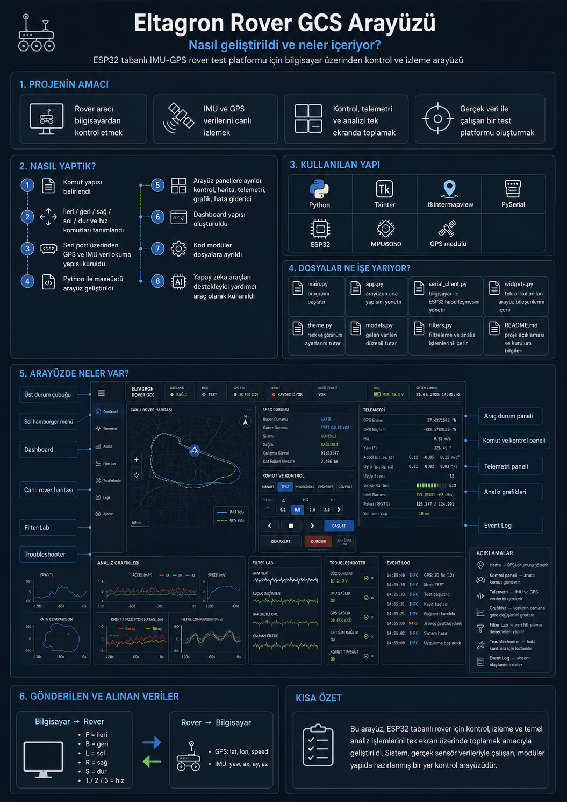
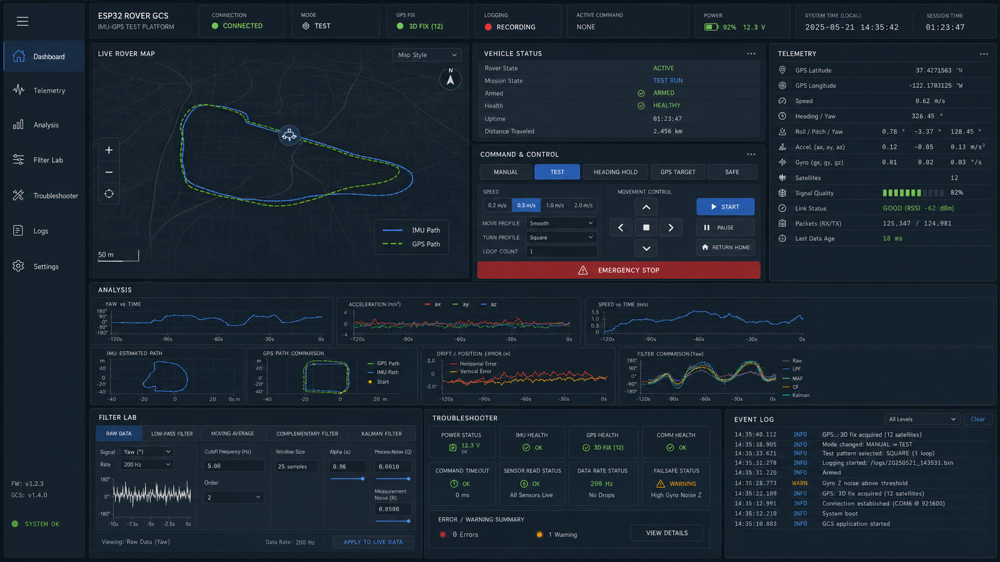

# Eltagron Rover GCS

ESP32 tabanlı IMU-GPS rover test platformu için hazırlanmış Python/Tkinter tabanlı yer kontrol arayüzü.

Bu arayüz; roverı manuel olarak kontrol etmek, seri port üzerinden gelen GPS/IMU verilerini izlemek, temel analiz grafikleri almak ve test sırasında oluşan durumları takip etmek için geliştirildi. Proje, Eltagron staj sürecinde kullanılan 6 tekerlekli IMU test platformunun PC tarafı kontrol yazılımıdır.



## Özellikler

- Seri port üzerinden bağlantı kurma ve bağlantıyı kesme
- Manuel sürüş komutları
- Klavye ile kontrol
- Acil durdurma butonu
- PC tarafı deadman stop kontrolü
- GPS ve IMU telemetri gösterimi
- Harita üzerinde rover konumu ve iz takibi
- Yaw, ivme ve hız grafikleri
- Filtre deneme alanı
- Hata giderici / durum kontrol paneli
- Log ekranı
- Yeniden boyutlandırılabilen dashboard panelleri
- Ayrılabilir kart yapısı ve sayfa sekmeleri

## Kullanılan komut protokolü

PC tarafından rover tarafına gönderilen komutlar:

| Komut | Açıklama |
|---|---|
| `F` | İleri |
| `B` | Geri |
| `L` | Sol |
| `R` | Sağ |
| `S` | Dur |
| `1` | Düşük hız |
| `2` | Orta hız |
| `3` | Yüksek hız |

Rover tarafından PC'ye gelen temel veri formatı:

```text
GPS:lat,lon,speed_kmph
IMU:yaw,ax,ay,az
```

Örnek:

```text
GPS:39.746986,30.474098,1.25
IMU:12.4,0.01,-0.02,0.98
```

## Kurulum

Python 3.12 ile test edildi.

```powershell
pip install -r requirements.txt
py -3.12 main.py
```

Alternatif olarak Windows üzerinde:

```powershell
.\run_ui.bat
```

## Dosya yapısı

```text
main.py                  # Uygulama giriş noktası
requirements.txt          # Python bağımlılıkları
run_ui.bat                # Windows çalıştırma dosyası
kart.cpp                  # Araç tarafı örnek/aktif firmware dosyası
ui_reference.png          # Arayüz referans görseli
rover_gcs/                # Arayüz kaynak kodları
scripts/                  # Küçük test ve yardımcı betikler
```

## Notlar

Bu yazılım sahte GPS veya IMU verisi üretmez. Harita, grafik ve telemetri alanları yalnızca seri porttan veri geldikçe güncellenir.

Otonom sürüş tarafı bu arayüzde görsel ve test altyapısı seviyesindedir. `HEADING HOLD` veya `GPS TARGET` gibi modların gerçek hareket üretmesi için araç tarafı firmware içinde ayrıca desteklenmesi gerekir.

## Güvenlik

Rover motorları test edilirken araç önce sehpa üzerinde veya tekerler boştayken denenmelidir. Li-ion batarya, motor sürücü ve güç hattı testlerinde kısa devre, aşırı akım ve ısınma riski vardır. Acil durdurma ve bağlantı kopma senaryoları saha testinden önce kontrol edilmelidir.

## Durum

Bu repo geliştirme aşamasındaki bir test platformuna aittir. Amaç bitmiş bir ürün sunmak değil; IMU/GPS tabanlı hareket analizi, telemetri izleme ve rover kontrolü için kullanılabilir bir Ar-Ge arayüzü oluşturmaktır.
